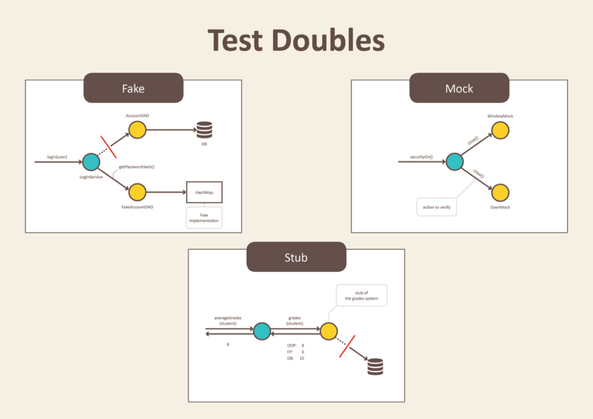

## Motivation
**A good unit test is:**
- Able to be fully **automated**
- Has full control over all the pieces running (Use mocks or stubs to achieve this isolation when needed)
- Can be run in any **order** if part of many other tests
- Runs in **memory** (no DB or File access, for example)
- **Consistently** returns the same result (You always run the same test, so no random numbers, for example. save those for integration or range tests)
- Runs **fast**
- Tests a **single logical concept** in the system
- **Readable**
- **Maintainable**
- **Trustworthy** (when you see its result, you don’t need to debug the code just to be sure)

[The art of unit testing](http://artofunittesting.com)

When **unit** testing: Having control (and with it isolation) as well as being independent, motivates to use fakes, stubs and mocks / spies.

## Different kinds of test objects
Definitions taken from [Test Doubles — Fakes, Mocks and Stubs](https://blog.pragmatists.com/test-doubles-fakes-mocks-and-stubs-1a7491dfa3da).

#### Fake
Fakes are objects that have working implementations, but not same as production one. Usually they take some shortcut and have simplified version of production code.

An example is an in-memory implementation of the database layer.

#### Stub
Stub is an object that holds predefined data and uses it to answer calls during tests. It is used when we cannot or don’t want to involve objects that would answer with real data or have undesirable side effects.

E.g.: Instead of a real database object, a stub has a definition, what data should be returned.

#### Mock
Mocks are objects that register calls they receive.

In test assertion we can verify on Mocks that all expected actions were performed.

## Mocking with Jest
Jest focuses on providing mock **functions** and not objects itself. Therefore it may not be the best choice to support TypeScript and it's classes.
Nevertheless, you can still use it to control your test environment well enough.

Other frameworks like Mocha, Jasmine, ts-mockito, ... (might) work differently.

### jest.fn
`jest.fn()` returns a mock function, that collects verification information about its calls, parameters and more.
`jest.spyOn(Type.prototype / object, 'method')` returns a similar function and behaves the same.

```
jest.fn(()=>'behavior')
jest.fn().mockImplementation(()=>'behavior')
```
returns a mock function with a concrete behavior.

`.mockImplementationOnce(fn)` is chainable and allows defining the behavior of subsequent calls.

For more details and more methods, see the [Mock fn api docs](https://jestjs.io/docs/en/mock-function-api) and the [expect api docs](https://jestjs.io/docs/en/expect.html).